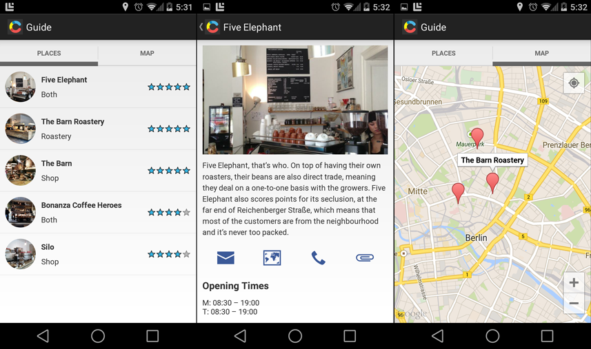

## Guide app

A generic app for shop guides which uses Contentful as CMS.

## Setup

Google Maps Android API V2 requires that you create an API key which corresponds with your keystore used to sign the APK once it is compiled. Please refer to the [official documentation][1] and follow a few easy steps to create an API key with your debug/release keystores, depending on your usage. When required to specify your SHA1 fingerprint along with the package name, you should provide the package name of this project: "**com.contentful.guide**". Once you have created your API key, please update [config.xml][2] accordingly.

## Screenshots

## License

Copyright (c) 2014 Contentful GmbH. See [LICENSE.txt][3] for further details.

[1]: https://developers.google.com/maps/documentation/android/start#get_an_android_certificate_and_the_google_maps_api_key
[2]: app/src/main/res/values/config.xml
[3]: LICENSE.txt
